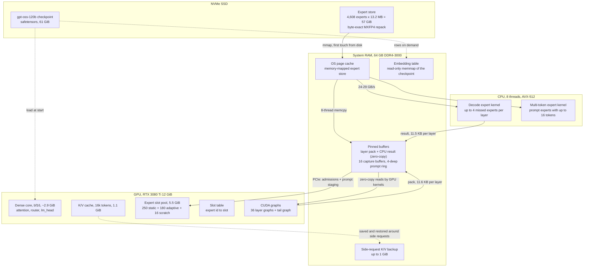
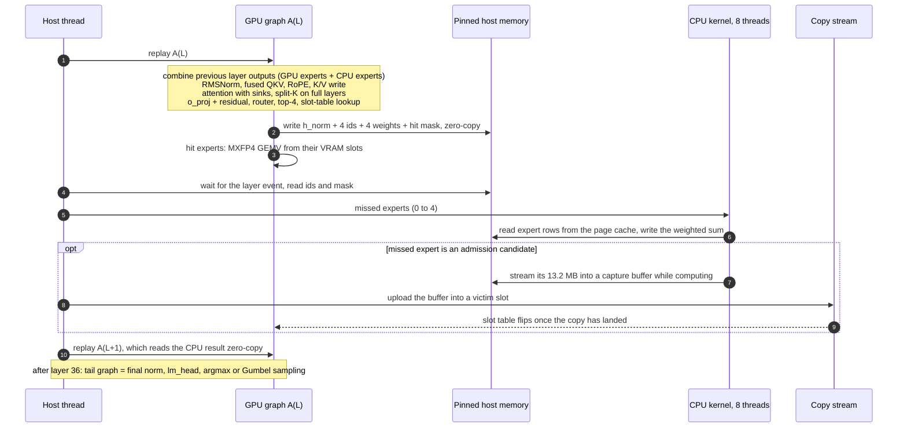
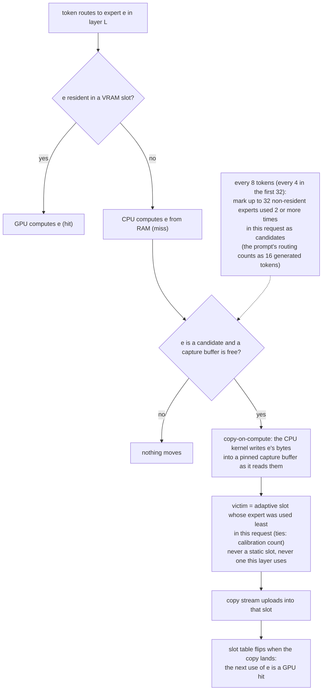
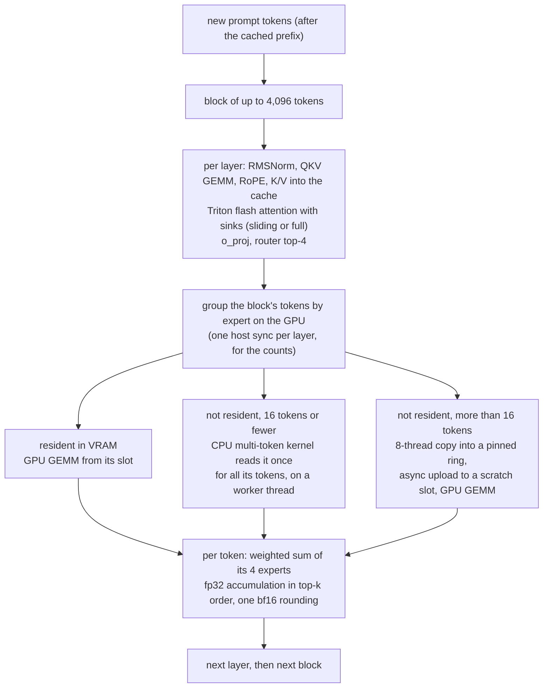
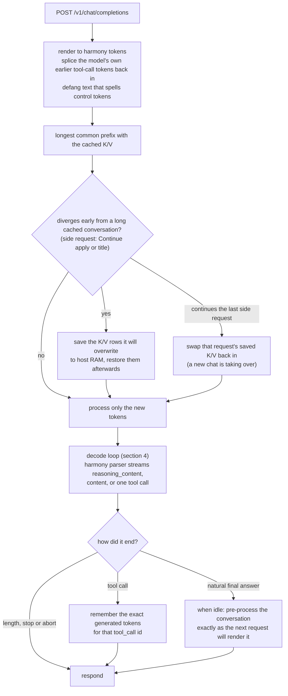

# How Neural works

A technical walk-through of the server in this repo: where every byte of gpt-oss-120B lives,
what runs on the GPU and on the CPU for each token, how experts move into VRAM, and how a
request flows through the prompt cache. For a plain-language overview, open
[`site/index.html`](../site/index.html).

Numbers carry a label: **MEASURED** on the development machine (RTX 3080 Ti 12 GiB,
i7-11700K with AVX-512, 64 GB DDR4-3000, NVMe), **CALCULATED** from shapes and code, or
**SIMULATED** from a recorded trace. `GiB` = 1024³ bytes.

## 1. The idea in one paragraph

gpt-oss-120B is a mixture-of-experts model: 36 layers, each with 128 expert networks, of
which the router picks 4 per token. The model is 61 GiB on disk and does not fit in a 12 GiB
GPU. Most of it is experts, and one token uses only 144 of the 4,608 (3%). Neural keeps
the dense core and the ~430 most useful experts in VRAM. It computes every other expert **on
the CPU, directly from RAM where its bytes already are**, at the same time as the GPU
computes the resident ones. Only a few kilobytes cross PCIe per layer, instead of 13.2 MB per
missing expert. The earlier research line that paged experts into the GPU over PCIe reached
only 0.98x llama.cpp on this machine. Computing where the bytes live is what made the
difference.

## 2. The model, in the units that matter

| quantity | value | label |
|---|---|---|
| layers / experts per layer / experts per token | 36 / 128 / 4 | config |
| hidden size, attention | 2880; 64 query heads, 8 K/V heads, head dim 64 | config |
| attention pattern | alternating sliding-window (128 tokens) and full layers, with attention sinks | config |
| vocabulary | 201,088 tokens | config |
| one expert (MXFP4 gate/up + down + scales) | 13,219,200 B in the raw store; 12,839,040 B in the packed-scale store (`tools\pack_store.py`, `weight_repr` `mxfp4_g32_ps4`: each 90-byte scale row stored as a base byte + 4-bit deltas, same values, -2.88%) | MEASURED (both stores; a packed layer file is 128 x 12,839,040 = 1,643,397,120 B) |
| all experts (expert store) | 4,608 x 13.2 MB = 57 GiB raw; 55.1 GiB packed | MEASURED |
| expert bytes touched per token | 144 x 13.2 MB = 1.9 GB | CALCULATED |
| dense core in VRAM (attention, router, norms, lm_head; bf16) | ~2.9 GiB | CALCULATED |
| K/V cache at 16,384 tokens | 36 x 16,384 x 2 KiB = 1.1 GiB | CALCULATED |

## 3. Memory topology

Budgets (default launcher, `--pool 5.5 --smax 16384 --static 250`):

| where | holds | size |
|---|---|---|
| VRAM | dense core, bf16 | ~2.9 GiB (CALCULATED) |
| VRAM | K/V cache, 16,384 tokens | 1.1 GiB (CALCULATED) |
| VRAM | expert slot pool: 446 slots = 430 usable (250 static core + 180 adaptive) + 16 scratch | 5.5 GiB |
| RAM | expert store, memory-mapped (page cache, not process memory) | up to 57 GiB |
| RAM | pinned: 16 x 13.2 MB capture buffers, 4 x 13.2 MB prompt ring, small packs | ~0.3 GiB |
| RAM | released: the store pages of all 430 VRAM-resident experts are dropped from the working set (`VirtualUnlock`), because VRAM holds them | -5.3 GiB |

The store has to stay in the page cache for speed. The CPU-side store (4,178 experts,
51.4 GiB) sits right at the edge of what a 64 GB PC has free next to ~10 GiB of other
programs (MEASURED). A long prompt makes Windows trim expert pages. The next answer then
faults them back 4 KB at a time while all 8 CPU threads wait. Measured: the first 128 tokens
of a first answer ran at 5-13 tok/s, against 15-17 once warm. Three things keep the right
pages in RAM:

- **VRAM-resident experts don't keep RAM copies.** Their pages are released at startup and
  excluded from the warm-up (`--release-resident`).
- **The startup warm-up covers what answers use.** It ranks experts by the hot-set counts plus
  the general calibration counts (about 0.8 coding + 1.2 general), because every answer starts
  with plain-language reasoning. It
  fills free RAM down to a 1.5 GiB margin. It touches the most likely experts last, so they
  are the youngest pages and the last ones Windows trims (`--warm-general`, `--warm-order`,
  `--warm-margin`).
- **A soft minimum working set** is set to the size reached after the warm-up (`--ws-min`).
  Windows then trims other processes' idle pages before the server's expert pages. It is a
  per-process hint that ends with the process.

## 4. One decoded token

Each layer runs as **one CUDA graph** (`A(L)`) built from five fused Triton kernels
(`fused_core.py`), followed by the GPU expert GEMVs for the resident experts. The host thread
only waits on an event, calls the CPU kernel for the misses, and does admission
bookkeeping. The GPU and CPU expert work for a layer overlap.

The five kernels of the fused core replace ~94 PyTorch kernels per layer (3.4-4.0 ms
instead of 10.0-10.7 ms per token for the whole core, MEASURED):

| kernel | work |
|---|---|
| `k_qkv` | combine residual + GPU + CPU expert outputs, RMSNorm, fused Q/K/V GEMV + bias, RoPE, write K/V at `pos` |
| `k_attn` / split-K `s1..s4` | grouped attention with sinks; full layers split the key range into 16 chunks (graph-capturable) |
| `k_oproj` | o_proj GEMV + bias + residual |
| `k_router` | post-attention RMSNorm, router GEMV, writes `h_norm` to the pinned pack |
| `k_topk` | top-4, softmax, slot-table lookup, GPU expert inputs, pinned pack (ids, weights, mask) |

The per-layer messages never touch the copy engine. The router kernels write the pinned
pack directly, and `k_fetch` reads the CPU result from pinned memory. Before this, the
13.2 MB admission copies queued ahead of them (GPU wait went from 9.5 to 4.8 ms/token,
MEASURED).

**Where a code token's time goes** (MEASURED, one request at 16.3 tok/s = 61 ms/token): 49 ms
CPU expert kernel, 4.4 ms waiting for the GPU, ~8 ms graph launches and bookkeeping. The CPU
reads RAM at 24-29 GB/s, and the machine's measured ceiling is ~29 GB/s. **For code, decode
speed is RAM bandwidth.**

## 5. Which experts live in VRAM

- **Static core (250 slots).** These are the experts most used by coding prompts, from
  `hotset_code.json`. They are never evicted, and their RAM pages are released.
- **Adaptive slots (180).** They start with the next most-used experts and follow the current
  request.
- **Use counts start from the prompt, but lightly.** The prompt's routing counts as at most 16
  generated tokens (`--prefill-weight`), rounded down per expert. After a long prompt, most of
  its counts therefore drop to zero. A long prompt, such as a file being read, routes
  differently from the answer written about it. At full weight its counts made admission
  chase the prompt's experts for the whole first answer. Measured VRAM hit rates:

  | | prompt at full weight | prompt worth 16 tokens |
  |---|---|---|
  | first answer | 0.18 | 0.31 |
  | follow-ups | 0.32 | 0.35 |
  | rewriting a file just read | 0.31 | 0.38 |
- **Admission is rate-limited** by the 16 capture buffers (~4.8 admissions per token on
  code). An admission needs no second read of the store, because the CPU reads the expert
  anyway to compute it. The capture write and the upload still use RAM bandwidth, and that
  bandwidth is exactly what code decode is short of.

Why not a smarter cache? Code touched 4,164 of the 4,608 experts in 1,398 tokens
(MEASURED trace). An oracle that knows the future would reach a 0.63-0.72 hit rate against
today's 0.35-0.44. However, every rule that only sees the past loses to the current policy
once admissions are charged for their RAM traffic: 168 vs ~96 expert-sized RAM transfers
per token (SIMULATED, `tools/cache_policy_sim.py`, [results](../benchmarks/RESULTS.md)).

## 6. Prompt processing

Prompts are processed **layer-major** in blocks of up to 4,096 tokens. Every layer runs over
the whole block, so each non-resident expert is read once per block, not once per token.
K/V go straight into the decode cache.

The threshold of 16 tokens was swept from 0 to 128 on agent steps, and 16 was fastest
(MEASURED, `benchmarks/tune_prefill*.json`). The CPU route wins for small steps: an expert
used by a few tokens costs one RAM read on the CPU, against a 13.2 MB PCIe transfer for the
GPU. `--ppl-check` compares the whole prompt path against the reference path.

## 7. A request, end to end

These features exist because agent harnesses resend the whole conversation on every step:

- **Tool-call splicing** (`harmony_render.py`). The chat template re-renders an earlier tool
  call differently from how the model generated it, and drops its reasoning. Splicing
  back the exact tokens keeps the cached prefix valid. A step inside a tool loop then only
  processes the new tool result: 0.4-0.6 s (MEASURED).
- **Idle canonical re-prefill.** After a final answer, the next request renders that answer
  without its reasoning. The server re-processes this while the user reads, so the next
  message starts from a warm cache.
- **Side-request protection.** Short side requests from the editor (apply, title) would
  otherwise overwrite the conversation's K/V. A side request reuses 99% of the cache
  instead of evicting it (MEASURED).

Diagnostics: `logs/requests.jsonl` records the timings of every request. `POST /neural/config`
tunes knobs at runtime. `POST /neural/trace` / `GET /neural/trace` records per-token
routing for offline studies.

## 8. Correctness

| component | reference | status |
|---|---|---|
| expert store | checkpoint MXFP4 tensors | byte-exact repack |
| CPU decode kernel | GPU MXFP4 GEMV / store reference | validated end to end; single- and multi-token kernels bit-identical at decode shapes |
| fused Triton core | eager PyTorch core | bf16 rounding points reproduced; fp32 accumulation order differs, so not bit-exact; router agreement 861/864 layers; quality inside the fp32-order null envelope (4 sigma, 3 nulls), ACCEPTED |
| prompt path | reference prefill | `--ppl-check` |
| slot residency | host tables vs device table + sampled slot bytes | `verify_residency()` invariants |

## 9. Performance and limits

| probe | result | label |
|---|---|---|
| decode, short mixed prompts vs llama.cpp (H8 research build: 7.0 GiB pool = 536 slots, 1k context, same PC, interleaved runs, llama.cpp's best config) | 1.46-1.56x | MEASURED |
| decode, short code prompt vs llama.cpp (same H8 research build) | 1.10-1.19x | MEASURED |
| code generation in the server, 0.1k / 4k / 9k context | 15.9 / 14.9 / 14.6 tok/s | MEASURED |
| reading a prompt vs llama-server b10361, both warm (`tools/bench_prompt_warm.py`): 13,000 / 3,000 tokens | 29.8 vs 93.2 s = **3.1x** / 8.1 vs 24.1 s = **3.0x faster** | MEASURED |
| 13,000-token coding conversation vs llama-server (fresh server each session, alternating, `tools/bench_vs_llama.py`): first answer after the prompt | 14.08 vs 13.70 tok/s = **1.03x** (all 5 runs of this configuration: 1.035x median, 0.93-1.18x per run; about level) | MEASURED |
| same: follow-up answers (9 each) | 18.07 vs 14.52 tok/s = **1.24x** | MEASURED |
| rewrite a 3,000-token file just read: writing speed over the same first ~192 tokens (llama.cpp stopped at 196) | 15.2 vs 14.3 tok/s = **1.06x** | MEASURED |
| agent step inside a tool loop | 0.4-0.6 s | MEASURED |

The limits, and why they hold:

- **Code decode is bounded by RAM bandwidth.** Code routing spreads across almost every
  expert, so ~60% of expert reads come from RAM.
- **Measured dead ends:**
  - a larger code hot set;
  - the GPU reading RAM in parallel with the CPU (28.5 vs 29.2 GB/s: same wall);
  - 12 threads;
  - past-only cache policies;
  - speculative decoding. Verifying 8 drafts reads 4.7x the experts of one token, so
    prompt-lookup drafting estimated 0.79-0.88x.

  See [`benchmarks/RESULTS.md`](../benchmarks/RESULTS.md).
- **Remaining levers are configuration:**
  - lower reasoning effort, for fewer tokens per agent step;
  - more free VRAM, for more slots. For example, move the desktop to the integrated GPU;
    +42 slots is about +4 hit points (SIMULATED).
- **Scope:**
  - one request at a time;
  - Windows;
  - NVIDIA GPU with 12 GiB or more;
  - a CPU with AVX-512;
  - 64 GB RAM.

## 10. How it got here

| step | change | vs llama.cpp |
|---|---|---|
| Neural research runtime | GPU computes every expert; misses paged over PCIe | 0.98x (MEASURED) |
| HYBRID-1 | CPU computes the misses | 0.82x fresh (MEASURED): per-layer overhead |
| HYBRID-2 | fused per-layer graphs, copy-on-compute admission | 1.26x warm, 0.85-0.89x fresh |
| HYBRID-3 (H8) | static core + `VirtualUnlock`, Triton fused core, zero-copy small transfers | **1.46-1.56x** |
| server v2/v3 | split-K attention, CPU prompt experts, tool-call splicing, idle re-prefill, side protection | agent sessions 12-27% faster per token than the first server |
| server v4 | prompt counts weighted in admission; RAM residency (release, warm-up ranking and order, soft minimum working set) | prompt 3.1x (both warm); long coding conversation: first answer 1.03x (from 0.83x, about level), follow-ups 1.24x |

The research project kept a complete lab notebook, including the falsified ideas. Neural
moved **1.84x fewer bytes per token** than llama.cpp from the start. What decided the race
was where the bytes were computed, not how many moved.
